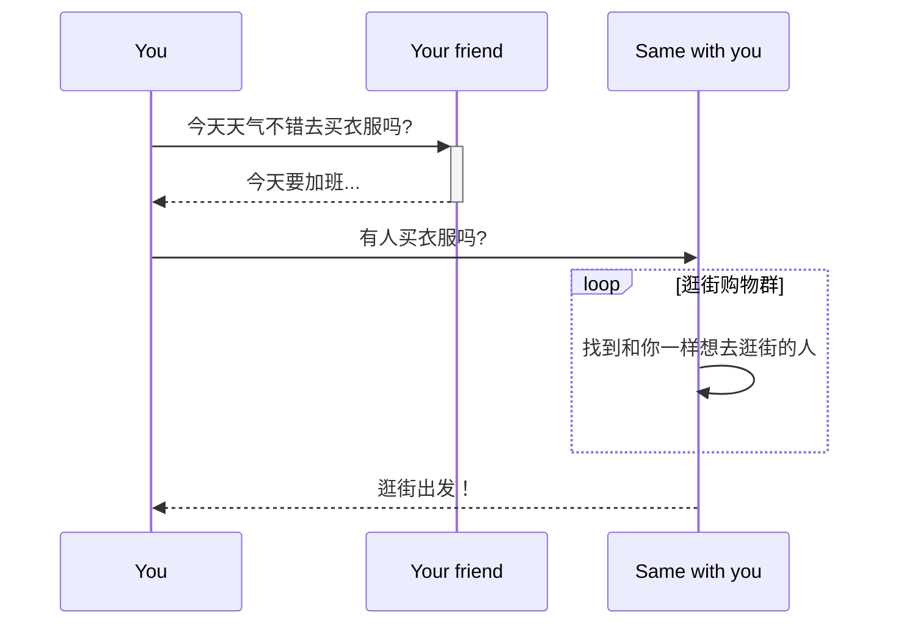

# flutter_mycommunity_app

# 项目简介
Hi，你好:raised_hand:	，当你想要出门逛街购物休闲娱乐时身边是不是总缺少一位小伙伴，为了尝试解决该痛点于是有了这个开源项目。客户端使用Flutter开发当前已经实现了一些常用功能：websocket聊天、消息推送、微信分享、支付宝支付、支付宝红包、地图定位搜索、动态列表、社交账户登录、语音图片上传等，线下商家入驻还在开发中。

由于是个人独立项目因此时间有限基本是采取实现功能即可的状态在开发因此可能存在许多隐藏bug、代码混乱等问题，欢迎大家参与pull request新增功能、代码优化重构、UI修改、图片素材都OK，目前app已经上架appstore和android商店，每天有10个左右注册新用户。

希望通过这个Flutter开源项目与大家一起完成应用客户端在多平台的部署，如实现pc和web上的IM聊天功能，同时还希望该项目可以在你需要开发一款独立应用时提供帮助。

业务流程  

# 编译版本

Flutter 2.10.3 • channel stable   
Tools • Dart 2.16.1

由于使用的部分组件可能还不支持高版本Flutter SDK,如果超过这个版本有可能无法编译。

## 待开发的功能
1. 微信支付（开发中）
2. 商户入驻
3. 消息免打扰，修改群名称等
4. 代码优化重构

## 截图

  |   | 
 ---- | ----- | ------  
   |  |  

## App演示
应用商店搜索出来玩吧
